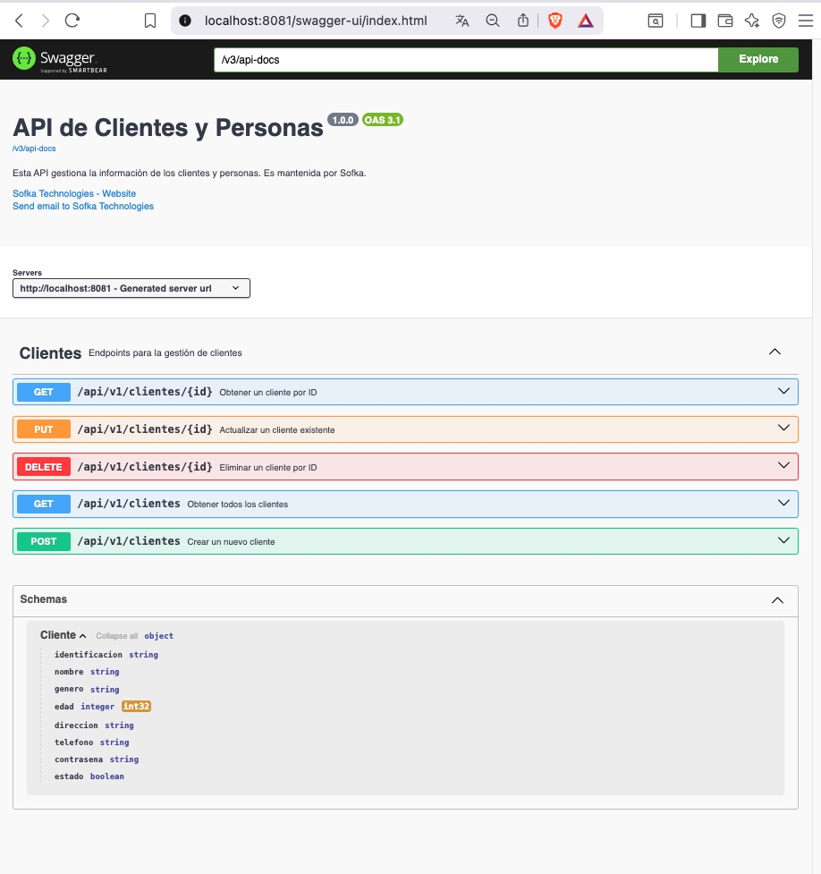
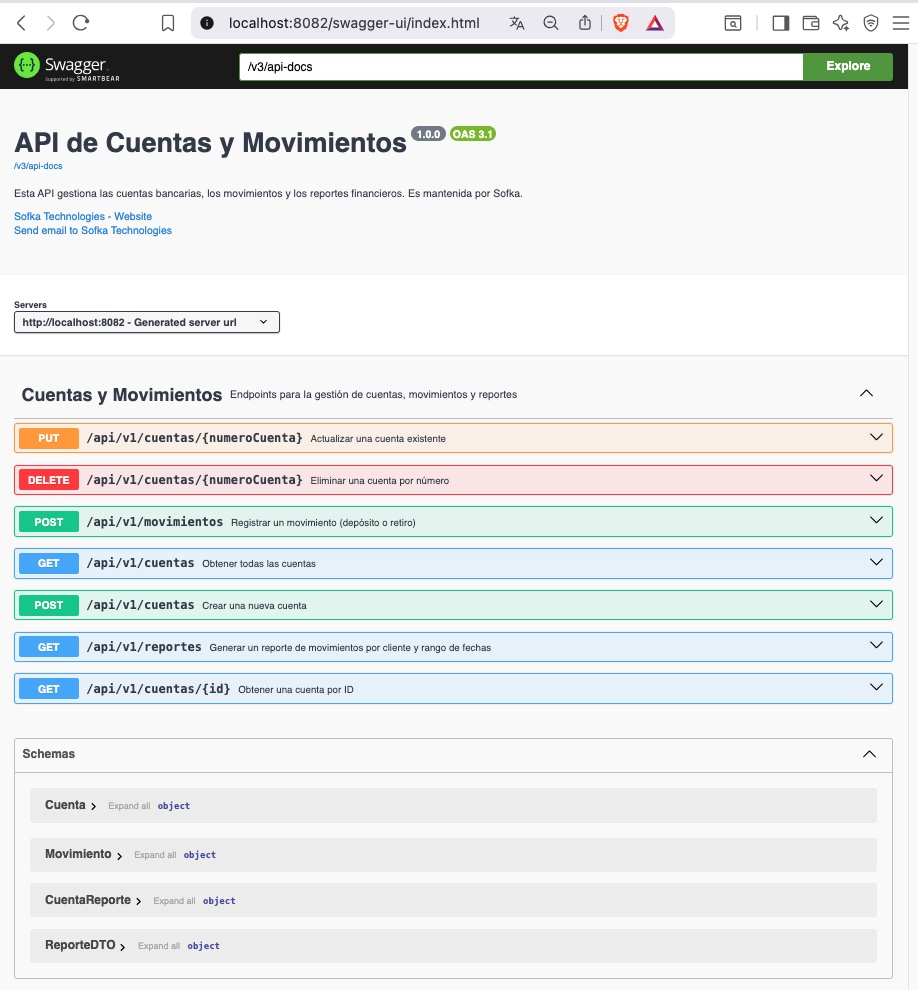
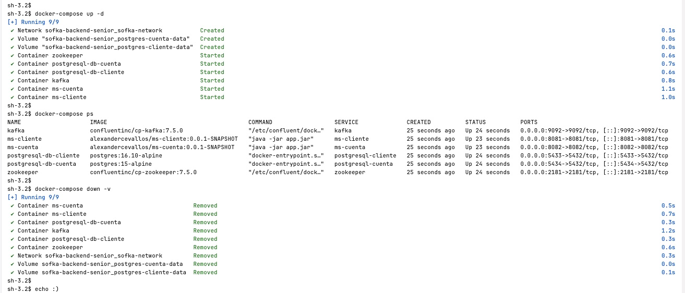

# Microservices Project with Spring Boot for Sofka

This is a microservices-based project for managing clients, accounts, and bank transactions. It uses **Apache Kafka** for asynchronous communication, ensuring a decoupled and scalable architecture.

The system is composed of two main microservices:

* **`ms-cliente`**: Manages client information. It communicates with `ms-cuenta` via Kafka to validate client existence.
* **`ms-cuenta`**: Manages bank accounts and transactions. It uses Kafka to validate a client's existence with `ms-cliente` before creating an account.

Data is persisted using **PostgreSQL**, with a clear and relational database schema.

## Prints Open API Specificication (OAS3)

**`ms-cliente`**


**`ms-cuenta`**


**`docker-compose`**


---

---

### 🏛️ Architecture

Communication between the microservices follows a **request-reply pattern** over Kafka.

1.  `ms-cuenta` sends a validation request message to a Kafka topic (`validar-cliente-request-topic`).
2.  `ms-cliente` consumes the request, validates the client, and sends a reply to a response topic (`validar-cliente-reply-topic`).
3.  `ms-cuenta` listens on the reply topic for the confirmation and proceeds with its business logic.

This approach ensures that services operate independently, so a failure in one doesn't bring down the other.

---

### 💻 Technologies Used

* **Spring Boot**: Main framework for microservice development.
* **Apache Kafka**: Event streaming platform for asynchronous communication.
* **PostgreSQL**: Relational database for data persistence.
* **Spring Data JPA**: Data access layer abstraction.
* **Maven**: Dependency management and build tool.
* **Testcontainers**: For robust integration testing with real databases and Kafka in Docker containers.
* **Docker Compose**: To orchestrate and run all services with a single command.

---

### ⚙️ Prerequisites

You'll need the following to run the project:

* **JDK 21** or higher
* **Maven**
* **Docker** and **Docker Compose**

---

### 🚀 Deployment and Execution

The easiest way to run this project is with Docker Compose, which handles setting up all necessary services automatically.

1.  **Clone the repository:**
    ```bash
    git clone https://github.com/AlexCevallosC/sofka-backend-senior.git
    cd sofka-backend-senior
    ```

2.  **Build the Docker images:**
    Ensure there are no build errors before creating the images.
    ```bash
    mvn clean install
    ```

3.  **Run with Docker Compose:**
    Use this command to start all services in the background:
    ```bash
    docker-compose up --build -d
    ```
    This will launch:
    * A **PostgreSQL** container for **`ms-cliente`** (`postgresql-cliente`).
    * A **PostgreSQL** container for **`ms-cuenta`** (`postgresql-cuenta`).
    * **Kafka** (`kafka`) and its dependency, **Zookeeper**.
    * The **`ms-cliente`** and **`ms-cuenta`** microservices.

4.  **Verify the status:**
    Check that all containers are running with:
    ```bash
    docker-compose ps
    ```

---

### 📝 API Endpoints

The following endpoints are available for interacting with each microservice:

#### **`ms-cliente` - CRUD Cliente**

* **`POST /api/v1/clientes`**: Creates a new cliente.
* **`GET /api/v1/clientes`**: Retrieves all clientes.
* **`GET /api/v1/clientes/{id}`**: Retrieves a cliente by ID.
* **`PUT /api/v1/clientes/{id}`**: Updates an existing cliente.
* **`DELETE /api/v1/clientes/{id}`**: Deletes a cliente.

#### **`ms-cuenta` - CRUD Cuenta**

* **`POST /api/v1/cuentas`**: Creates a new cuenta (validates the client's existence via Kafka).
* **`GET /api/v1/cuentas`**: Retrieves all cuentas.
* **`GET /api/v1/cuentas/{id}`**: Retrieves a cuenta by its number.
* **`PUT /api/v1/cuentas/{id}`**: Updates an existing cuenta.
* **`DELETE /api/v1/cuentas/{id}`**: Deletes a cuenta.

#### **`ms-cuenta` - Endpoints Movimientos**

* **`GET /api/v1/movimientos/{id}`**: Get a movimiento por su ID.
* **`POST /api/v1/movimientos`**: Create a new movimiento (Depósito o Retiro).

#### **`ms-cuenta` - Endpoint Reporte**

* **`GET /api/v1/reportes?fechaInicio={fecha}&fechaFin={fecha}&clienteId={id}`:** Generate a reporte of movimientos by cliente and rango de fechas.


---

### 🧪 Integration Tests

This project includes robust integration tests that use **Testcontainers** to create a realistic testing environment. These tests validate how the services interact with a real PostgreSQL database, ensuring the reliability of the persistence and inter-service communication layers.

To run the tests:

```bash
mvn clean test